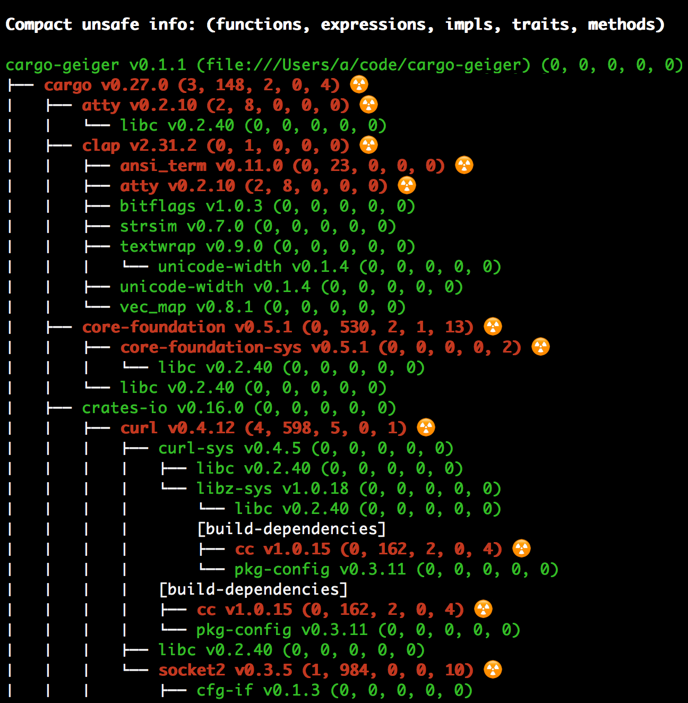

# cargo-geiger ☢

A program that list statistics related to usage of unsafe Rust code in a Rust
crate and all its dependencies.

This project is in its current state a quick-n-dirty, glued together, remix of
two other cargo plugin projects:
<https://github.com/icefoxen/cargo-osha> and
<https://github.com/sfackler/cargo-tree>.

# Usage

1. `cargo install cargo-geiger`
2. Navigate to the same directory as the Cargo.toml you want to analyze.
3. `cargo geiger`
4. Please don't look at the `--help` flags, they are inherited from cargo-tree
   and may not work as intended. TODO: Review and update command line flags.

# Output example:

# Why even care about unsafe Rust usage?

When and why to use unsafe Rust is out of scope for this project, it is simply
a tool that provides information to aid auditing and hopefully to guide
dependency selection. It is however the opinion of the author of this project
that __libraries choosing to abstain from unsafe Rust usage when possible should
be promoted__.

This project is an attempt to create pressure against __unnecessary__ usage of
unsafe Rust in public Rust libraries.

# Why the name?

<https://en.wikipedia.org/wiki/Geiger_counter>

Unsafe Rust and ionizing radiation have something in common, they are both
inevitable in some situations and both should preferably be safely contained!

# Known issues

- Crates with nested crates can currently report inaccurate stats.
- Both base projects, cargo-tree and cargo-osha could be depended on if
  refactored into library and application parts.
- Proper logging should be sorted out.
- Command line flags needs review and refactoring for this project.
- Will continue on syn parse errors. Needs a new command line flag and should
  default to exit on errors(?).
- Could probably benefit from parallelization. One `.rs` file per core should
  be parsed at all times.

# Roadmap

- An optional whitelist file at the root crate level to specify crates that are trusted to use unsafe (should only have an effect if placed in the root project).
- More and better ways to analyse unsafe usage
- Improved output format?
- Additional output formats?
- Fixing known issues! :)
